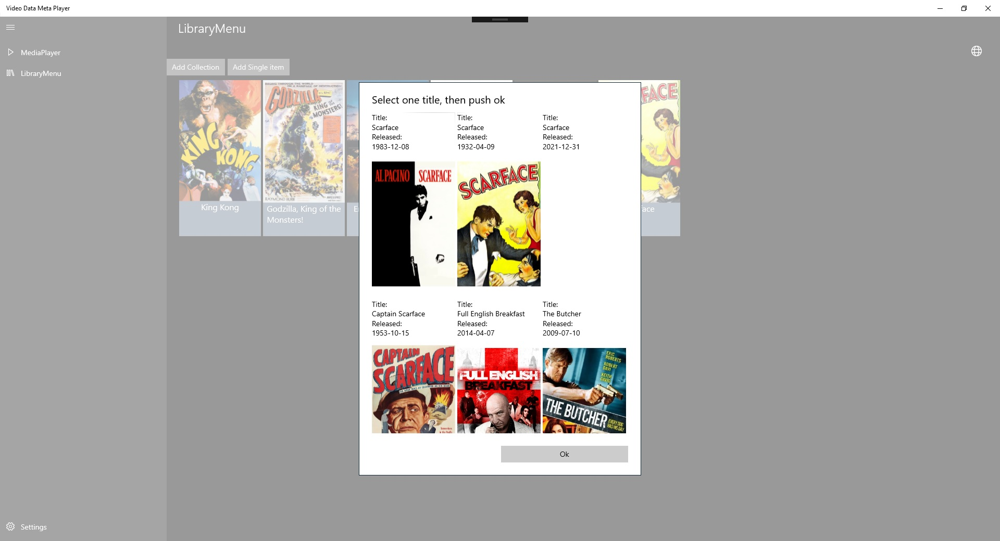

# VDMP_public

Et prosjekt som ble utviklet da jeg startet å lære .NET Core.
Utviklet i C# med .NET Core rammeverket, som en UWP applikasjon.

Krever .NET Core 2.2.
For å kunne benytte seg av applikasjonen må man ha en egen V3 API nøkkel hos TMDB, og man må lage seg en lokal via lokal API'et.
(Lag opp i mot bruker api, etter User model).

Installasjons instrukser: 
Bygg solution. 
Rebuild App og så deploy den. 
Bygg api. Sett api og app som oppstarts applikasjoner i <Multiple Startup Projects>. 

    

VDMP er en applikasjon som brukeren kan benytte til å knytte filmer dem har på harddisken sin med metadata. 
Etter brukeren har logget seg inn, har dem muligheten til å opprette et eller flere "bibliotek". 
Når brukeren har opprettet et bibliotek, kan man navigere inn i dette, og å velg at man kan legge inn en samling med filmer, eller et enkelt objekt. 
Når brukeren har valgt en eller flere filmer, starter de å analyseres. Det blir hentet ut et navn fra filen, som benyttes som et søk oppimot TMDb. Resultatet (hvis den finner noe) blir benyttet til å gjøre et "optimistisk" oppslag mot den første tittelen som passer best.  

Filmen blir så lagt inn i biblioteket, hvor brukeren kan behandle dem. 
Skulle resultatet som ble gitt tilbake ikke være tilfredsstillende, kan brukeren høyre klikke på filmen, å velge mellom å slette(Fjerner ikke filen!) eller oppdatere den. 
Hvis man ønsker å oppdatere den, blir man forespurt et hvilken tittel man søker. Etter brukeren har skrevet inn tittelen, returneres flere valg til brukeren, som kanskje passer bedre. 

    

 
Når brukeren har valgt seg inn på en film, kan de se metadataen som er hektet på den. Her er det også mulighet til å gi stjerner til filmen basert på sin egen opplevelse. 
